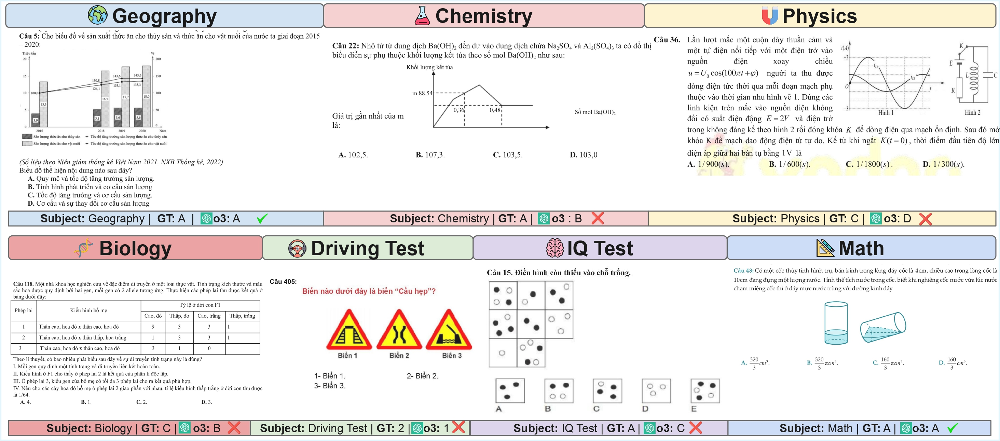

# ViExam: Are Vision Language Models Better than Humans on Vietnamese Multimodal Exam Questions?

<div align="center">    
  <p style="font-size: 20px;">by 
    <a href="https://www.linkedin.com/in/dang-thi-tuong-vy-00a357278/">Vy Tuong Dang</a><sup>1*</sup>,
    <a href="https://anvo25.github.io/">An Vo</a><sup>1*</sup>,
    <a href="https://www.linkedin.com/in/quang-tau-a708b4238/?originalSubdomain=kr">Quang Tau</a><sup>1</sup>, 
    <a href="https://www.resl.kaist.ac.kr/members/master-student#h.fiaa4al7sz8u">Duc Dm</a><sup>1</sup>, 
    <a href="https://www.resl.kaist.ac.kr/members/director">Daeyoung Kim</a><sup>1</sup>
  </p>
  <p>
    <sup>*</sup>Equal contribution<br>
    <sup>1</sup>KAIST
  </p>

[](https://viexam.github.io)
[](https://arxiv.org/abs/xxxx.xxxxx)
[](https://huggingface.co/datasets/username/viexam)
[](LICENSE)

</div>

---

## 📌 Abstract

<p align="center">
  
</p>

*Vision Language Models (VLMs) demonstrate remarkable capabilities on English multimodal tasks, but their performance on low-resource languages with genuinely multimodal educational content remains largely unexplored. In this work, we introduce **ViExam**, the first comprehensive Vietnamese multimodal exam benchmark containing **2,548 multimodal questions** across 7 academic domains. We find that state-of-the-art VLMs achieve only **57.74%** accuracy while underperforming average Vietnamese test-takers (66.54%). Only the thinking VLM o3 (74.07%) exceeds human average performance, yet still falls substantially short of human best performance (99.60%). Cross-lingual prompting with English instructions while maintaining Vietnamese content fails to improve performance, decreasing accuracy by 1 percentage point for SOTA VLMs. Human-in-the-loop collaboration can partially improve VLM performance by 5 percentage points. Our work presents the first systematic evaluation of VLM capabilities on Vietnamese multimodal educational content.*

---

## 👋 Trying out our questions on your model

Use these challenging Vietnamese multimodal exam questions where most tested models fail to answer correctly. Each question requires understanding both Vietnamese text and visual elements like diagrams, charts, and illustrations.

---

## 🧪 Dataset Overview

| Subject      | #Questions |
| ------------ | ---------- |
| Mathematics  | 456        |
| Physics      | 361        |
| Chemistry    | 302        |
| Biology      | 341        |
| Geography    | 481        |
| Driving Test | 367        |
| IQ Test      | 240        |
| **Total**    | **2,548**  |

> Each question is an image containing both Vietnamese text and visuals. Most are 4-option multiple-choice questions. No screenshots of text-only questions are included — all questions are genuinely **multimodal**.

## 🚀 Quick Start Guide

### Option 1: Use Pre-built Dataset (Recommended for evaluating your models)

**If you just want to evaluate VLMs on our Vietnamese exam questions:**

🔥 **Download the complete dataset from Hugging Face** with full images and annotations:
- Go to our [Hugging Face dataset](https://huggingface.co/datasets/username/viexam)
- Download ready-to-use Vietnamese multimodal exam questions

This is the fastest way to get started with evaluation.

### Option 2: Reproduce/Generate Dataset

**If you want to reproduce our data pipeline or create custom variations:**

Please follow the installation and generation steps below to run the complete pipeline locally.

---

## 💻 Getting Started

```bash
git clone https://github.com/TuongVy20522176/ViExam.git
cd viexam
pip install -r requirements.txt
```

## 📊 Tasks

ViExam spans **7 distinct domains** representative of Vietnamese educational assessments:

### Academic Subjects (Tasks 1-5)
- **Mathematics**: Function analysis, calculus, geometry (456 questions)
- **Physics**: Mechanics, waves, thermodynamics (361 questions) 
- **Chemistry**: Organic chemistry, electrochemistry (302 questions)
- **Biology**: Genetics, molecular biology (341 questions)
- **Geography**: Data visualization, economic geography (481 questions)

### Practical Assessments (Tasks 6-7)
- **[Driving Test](dataset/question_image/driving/)**: Traffic rules, road signs, safety scenarios (367 questions)
- **[IQ Test](dataset/question_image/iq/)**: Pattern recognition, logical reasoning (240 questions)

*All questions integrate Vietnamese text with visual elements (diagrams, charts, illustrations) at multiple resolutions.*

---

## 🚀 Quickstart

### 1. Install requirements

```bash
pip install -r requirements.txt
```

### 2. Run evaluation on VLMs

```bash
# Prepare evaluation batches
python batch_api_code/main_batch_prepare.py \
  --model claude-sonnet-4-20250514 \
  --input-file dataset/metadata/full_vqa.json \
  --prompt_language vn

# Execute batch evaluation
python batch_api_code/main_batch_api.py
```

Or for individual models:

```bash
# Evaluate single model
python api_code/main_api.py \
  --model o3-2025-04-16 \
  --prompt_language vn \
  --input-file dataset/metadata/cropped_random_subset_vqa_description.json

# Cross-lingual evaluation
python api_code/main_api.py \
  --model gpt-4.1-2025-04-14 \
  --prompt_language en \
  --input-file dataset/metadata/full_vqa.json
```

### 3. Analyze results

```bash
python src/result.py
```

---

## ✏️ Human-in-the-loop Enhancement

We provide web-based tools for:

* **Question Selection**: `src/choose_question.html` - Filter and select questions
* **OCR Verification**: `src/ocr_ground_truth.html` - Edit OCR results and descriptions
* **Quality Control**: `src/check_question.html` - Manual verification interface

---


## 🗂️ Repository Structure

```
viexam/
├── api_code/                           # Individual VLM evaluation
│   ├── api_handlers/                   # API wrapper for VLMs
│   ├── main_api.py                     # Main API call logic
│   └── main_api_qwen.py               # Qwen-specific evaluation
│
├── batch_api_code/                     # Batch processing for large-scale evaluation
│   ├── main_batch_prepare.py          # Prepare evaluation batches
│   ├── main_batch_api.py              # Execute batch evaluation
│   └── handlers/                      # Batch processing utilities
│
├── dataset/
│   ├── question_image/                # Individual exam questions by domain
│   ├── metadata/                      # Question annotations and ground truth
│   └── images/                        # Dataset overview images
│
├── src/                               # Full pipeline for data extraction
│   ├── cut_question.py               # Question boundary detection
│   ├── convert_pdf_to_image.py       # PDF → PNG conversion
│   ├── check_question.html           # Manual verification interface
│   ├── choose_question.html          # Question selection tool
│   ├── ocr_ground_truth.html         # OCR verification tool
│   └── result.py                     # Accuracy analysis
│
└── api_key/                          # API credentials (not tracked)
    ├── claude_key.txt
    ├── openai_key.txt
    └── ...
```

---

## 📈 Key Findings

Our evaluation reveals several important insights:

1. **Strong OCR Performance:** VLMs achieve strong OCR performance on Vietnamese text (6% CER and 9% WER), confirming that poor performance stems from multimodal reasoning challenges rather than basic text recognition failures
2. **Performance Gap:** SOTA VLMs achieve only 57% mean accuracy across 7 domains, with Geography most accessible (72%) and Physics most challenging (44%)
3. **Thinking Models Excel:** The thinking VLM o3 substantially outperforms non-thinking VLMs (74% vs. 48-59%)
4. **Option B Bias:** VLMs exhibit significant bias toward option B (31%) in multiple-choice questions, suggesting failures are not purely due to reasoning limitations but may be partially attributable to training data bias
5. **Multimodal Challenge:** VLMs perform better on text-only questions (70%) versus multimodal questions (61%), confirming that multimodal integration poses fundamental challenges
6. **Open-source Gap:** Open-source VLMs achieve substantially lower performance than closed-source/SOTA VLMs (27.7% vs. 57%)
7. **Cross-lingual Mixed Results:** Cross-lingual prompting shows mixed results - improving open-source VLMs (+2.9%) while hurting SOTA VLMs (-1.0%)
8. **Human-AI Collaboration:** Human-in-the-loop collaboration provides modest gains with OCR help (+0.48%) but substantial improvement with full text and image editing (+5.71%)

---
